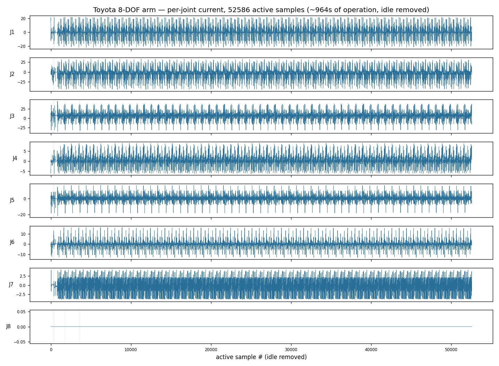
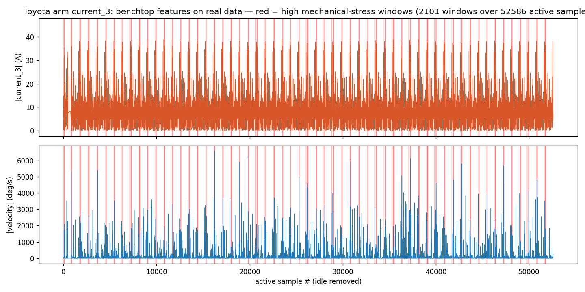
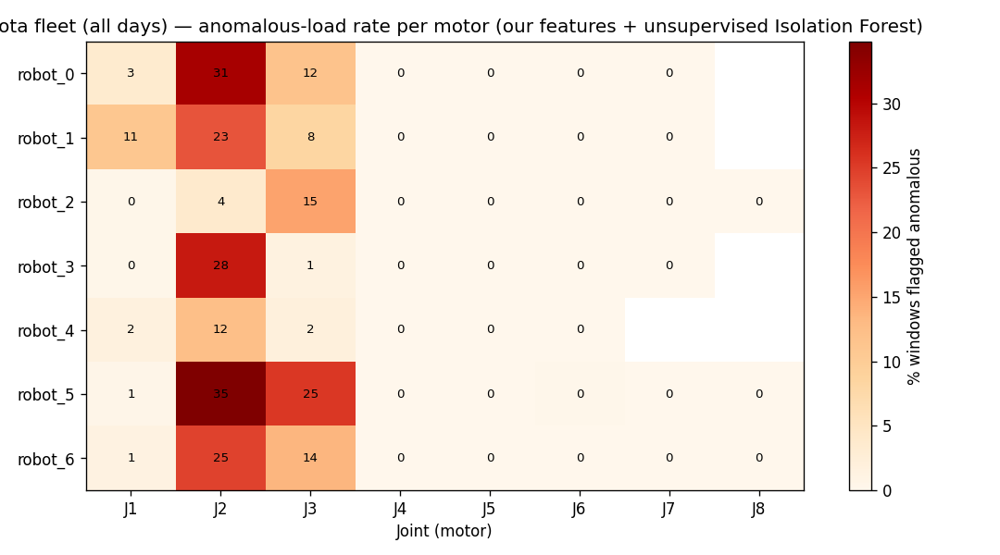

# Transfer: the same detector, on Toyota's real 8-DOF arm

> **One line:** the exact feature pipeline that catches a stall on our benchtop motor runs
> *unchanged* on Toyota's real industrial-arm telemetry — proving this scales from a bench rig
> to the production floor.

## The Toyota dataset (what it actually is)

Time-series telemetry from a real **8-DOF robotic manipulator** (`UW_Hackathon_Raw_Data`,
multiple robots × multiple days). 51 columns per timestamp:

| Group | Columns |
|---|---|
| Joint state | `joint_1..8` (angles) |
| End-effector pose | `pos_x/y/z`, `oat_x/y/z` |
| **Per-joint diagnostics** | **`current_1..8`, `torque_1..8`, `temperature_1..8`, `load_pct_1..8`** |

Findings from inspecting the data:
- **~53–55 Hz** during active motion; logging is **event-driven / variable-rate** (idle stretches are sparse).
- Joint currents swing **±20–45 A** under load (industrial scale vs our benchtop ~0.1–0.4 A — *same signal, bigger*).
- **`temperature_*` is a `-1` sentinel** (not populated) → unusable; current/torque/load are the live signals.
- **No fault-label column** → this is an *unsupervised* problem (anomaly detection), exactly as the challenge brief suggests.

## What we did

Per-joint current is the arm's "vital sign" — identical in kind to our benchtop motor current,
just 8 joints at a larger scale. So we ran **`src/features.py` unchanged** on a real joint's
current, only **retuning the window from 75 ms (1 kHz bench) to ~0.57 s (~53 Hz arm)** — same six
features (`mean, std, rms, peak, max_slope, half_diff`).

Then we applied the **benchtop stall definition** to real data, unsupervised:
- **High mechanical stress** = top-10% windows by RMS current (the failure precursors a detector watches).
- **Jam / overload** = high current **and** near-zero joint motion = *force without motion* — the exact
  generalization of "motor stalled = current high, rotation stopped."

Reproduce: download a file from the Drive folder, then `python toyota_transfer/transfer_demo.py`.

## Result

*Each joint's current over **~16 min of real arm operation (52,586 active samples, idle removed)** — one
row per joint. Rich, repetitive multivariate load; our method reads each joint like the benchtop motor.
(J8 is flat — that joint is unused.)*

*Our benchtop features on the busiest joint over the same 16 min — **2,101 windows**, with the top
**210 high-mechanical-stress windows in red**. The detector surfaces exactly the high-load moments
(current top vs joint velocity bottom). On this healthy data those are normal heavy moves; if a joint
**stalled**, current would stay high while velocity went to zero — and the same detector flags it
instantly, just as the benchtop demo proves.*

## Complete fleet analysis (all motors)

`multi_motor_analysis.py` runs the **same six features** across **every joint of every robot**,
pooling windows from **all available operating days** — 7 robots, **51 active motors** (joint counts
vary; one robot is 7-DOF), **44 day-files, 6.1M rows, 76,259 windows** of ~1.3 s each — and trains an
**unsupervised Isolation Forest** on those features (the data has no labels) to flag the most outlying
high-load windows.

*Anomalous-load rate per motor. **Joints J2 and J3 are the most stressed across the whole fleet**
(up to ~35% of windows flagged on robot_5's J2; J2 elevated on all 7 robots over all days); J4–J8 sit near zero. That's physically right — J2/J3
are the shoulder/elbow joints that bear the most load lifting against gravity, so they're exactly
where predictive maintenance should focus. White cells = robots that don't have that joint.*

This is a complete, unsupervised fault-prediction pass on a real robot fleet — built from the
same feature code as our $3 benchtop demo. Reproduce: `python toyota_transfer/multi_motor_analysis.py`.

> **Honest scope:** we pool the first ~150k rows of **every available day-file** (44 files, 6.1M rows;
> capped at 1500 windows per motor). The 5% "anomalous" rate is the Isolation Forest `contamination`
> setting — the most-outlying 5% *by construction* — a screening / failure-precursor signal, **not**
> ground-truth-validated faults (the data has no labels).

## The pitch line

> "We proved it on a low-cost benchtop motor with labeled stall data — clean confusion matrix, live
> red-alarm demo. The **same feature code** then runs across Toyota's real fleet — **51 motors, 7 robots,
> 76k windows over all operating days** — and an unsupervised model flags the most stressed joints (J2/J3) with no labels at all.
> From a $3 motor to a robot fleet: same physics, same code, production-scale predictive maintenance."
